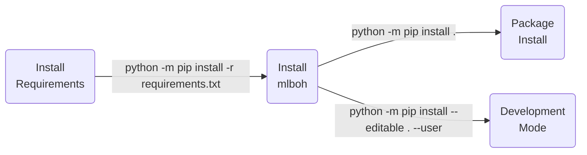

| **Authors**  | **Project** |  **Documentation** | **Build Status** | **Code Quality** | **Coverage** |
|:------------:|:-----------:|:------------------:|:----------------:|:----------------:|:------------:|
| [**N. Curti**](https://github.com/Nico-Curti) <br/> S&C26 student | **mlboh** | [](https://github.com/Nico-Curti/mlboh/actions/workflows/docs.yml) | [](https://github.com/Nico-Curti/mlboh/actions/workflows/python.yml) | [](https://app.codacy.com/gh/Nico-Curti/mlboh/dashboard?utm_source=gh&utm_medium=referral&utm_content=&utm_campaign=Badge_grade) | **TODO** |

[](https://github.com/Nico-Curti/mlboh/pulls)
[](https://github.com/Nico-Curti/mlboh/issues)

[](https://github.com/Nico-Curti/mlboh/stargazers)
[](https://github.com/Nico-Curti/mlboh/watchers)

<a href="https://github.com/UniboDIFABiophysics">
  <div class="image">
    
  </div>
</a>

# mlboh v0.0.1

## Example of project for Software&Computing course (aa 2025-26)

This is an example project developed during the Software&Computing course of the Applied Physics curriculum in collaboration with the students.

**Not intended for exam use.**

* [Overview](#overview)
* [Prerequisites](#prerequisites)
* [Installation](#installation)
* [Usage](#usage)
* [Testing](#testing)
* [Table of contents](#table-of-contents)
* [Contribution](#contribution)
* [References](#references)
* [Authors](#authors)
* [License](#license)
* [Acknowledgments](#acknowledgments)
* [Citation](#citation)

## Overview

Write an overview about the context and/or project that you have developed.
In the documentation you can use also fancy layouts, tables, and references to the code (like [this](https://github.com/Nico-Curti/mlboh/blob/main/README.md))

| :triangular_flag_on_post: Note |
|:-------------------------------|
| This is an important note for your documentation! |

## Prerequisites

The complete list of requirements for the `mlboh` package is reported in the [requirements.txt](https://github.com/Nico-Curti/mlboh/blob/main/requirements.txt)

## Installation

Python version supported : 

The `Python` installation for *developers* is executed using [`setup.py`](https://github.com/Nico-Curti/mlboh/blob/main/setup.py) script.



## Usage

You can use the `mlboh` library into your Python scripts or directly via command line.

### Command Line Interface

The `mlboh` package can be used directly via command line using the following syntax:

```bash
$ mlboh --help
usage: mlboh [-h] [--version] --input INPUT [--parallel {threads,processes}] [--num-workers NUM_WORKERS]

options:
  -h, --help            show this help message and exit
  --version, -v         Get the current version installed
  --input INPUT, -i INPUT
                        The input file from which to read the data. The file must be in CSV format with the column of
                        labels identified by the name "Y"; all the other columns will be interpreted as input
                        columns/features
  --parallel {threads,processes}, -p {threads,processes}
                        Parallelization scheme to use for the ML cross-validation
  --num-workers NUM_WORKERS, -n NUM_WORKERS
                        The number of worker threads/processes to use for parallel computation. Default is 4.
```

## Testing

**TODO**

## Table of contents

**TODO**

## Contribution

| :triangular_flag_on_post: Note |
|:-------------------------------|
| The following files are missing an they must be inserted/updated according to your needs/projects |

Any contribution is more than welcome :heart:. Just fill an [issue](https://github.com/Nico-Curti/mlboh/blob/main/.github/ISSUE_TEMPLATE/ISSUE_TEMPLATE.md) or a [pull request](https://github.com/Nico-Curti/mlboh/blob/main/.github/PULL_REQUEST_TEMPLATE/PULL_REQUEST_TEMPLATE.md) and we will check ASAP!

See [here](https://github.com/Nico-Curti/mlboh/blob/main/.github/CONTRIBUTING.md) for further informations about how to contribute with this project.

## References

<blockquote>1- Author et al, "Title", Journal, Year </blockquote>

## Authors

*  [](https://github.com/Nico-Curti) [](https://www.unibo.it/sitoweb/nico.curti2) **Nico Curti**

* **All the students of the Software&Computing course (aa. 2025-26)**

See also the list of [contributors](https://github.com/Nico-Curti/mlboh/contributors) [](https://github.com/Nico-Curti/mlboh/graphs/contributors/) who participated in this project.

## License

The `mlboh` package is licensed under the GPLv3 [License](https://github.com/Nico-Curti/mlboh/blob/main/LICENSE).

## Acknowledgments

Thanks goes to all contributors of this project.

## Citation

If you have found `mlboh` helpful in your research, please consider citing the original repository

```BibTeX
@misc{mlboh,
  author = {Curti, Nico and Software&Computing students},
  title = {mlboh - Develop a machine learning workflow for educative purposes in Software&Computing course},
  year = {2026},
  publisher = {GitHub},
  howpublished = {\url{https://github.com/Nico-Curti/mlboh}}
}
```